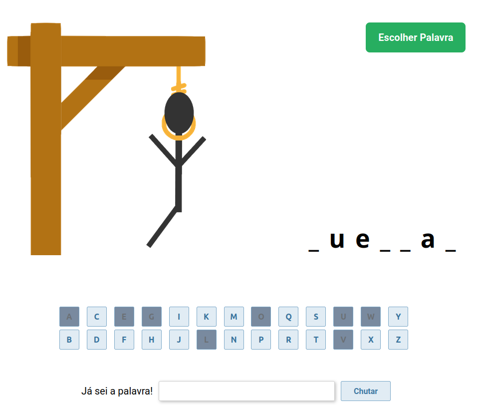

# <p align = "center">HangMan Game (React JS)</p>

<p align = "center"></p>

## :white_circle: Technologies

- [JavaScript](https://www.javascript.com/)
- [HTML5](https://html5.org/)
- [ReactJS](https://reactjs.org/)
- [Styled-Components](https://styled-components.com/)

# 🏁 Let's go!

This project was bootstrapped with Create React App, so you need to install Node.js and npm first, in order to test the project. First clone this github repository into your computer, then open the folder cloned:

```bash
git clone https://github.com/ecocaval/jogo-da-forca-ReactJS.git && cd jogo-da-forca-ReactJS
```

Then you must install all the dependencies running:

```bash
npm install
```

And finally, run:

```bash
npm start
```

The website is also acessable through the vercel deploy, click the following link to see it: 

- [Enter the game](https://jogo-da-forca-react-js.vercel.app/)
